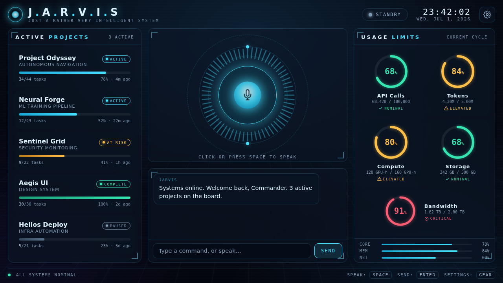

# J.A.R.V.I.S — Command Interface

A futuristic, voice-driven dashboard you can **speak to**. It models a Jarvis-style
AI assistant and shows your **projects** and **usage limits** in a sci-fi HUD —
arc-reactor core, animated audio visualizer, glowing radial gauges, and a live
conversation log.



## Features

- 🎙️ **Talk to it** — click the reactor (or press **Space**) and speak. Uses the
  browser's Web Speech API for recognition, and speaks replies back with a
  deep synthesized voice.
- 🧠 **Jarvis brain** — answers questions about your projects and usage limits
  out of the box, fully offline. Try:
  - *"Status report"* / *"Brief me"*
  - *"Which projects need attention?"*
  - *"How many tokens are left?"* · *"Are we near any limits?"*
  - *"Tell me about Project Odyssey"*
- 🤖 **Optional real conversation** — paste an Anthropic API key in **Settings**
  to route free-form questions to Claude (`claude-opus-4-8`), with your live
  dashboard state injected as context. Without a key it stays fully local.
- 📊 **Usage-limit gauges** — animated radial gauges with reserved status colors
  (nominal / elevated / critical), each labeled — never color-alone.
- 🛰️ **Futuristic HUD** — drifting grid, scanlines, spinning rings, pulsing
  reactor, glass panels with corner ticks.
- ⌨️ **Type instead** — a text composer works everywhere, even where the mic
  isn't available.

## Run it

Voice input and the microphone visualizer need a **secure context**
(`https://` or `localhost`) — opening `index.html` from `file://` will show the
dashboard but the mic may be blocked. Serve it locally:

```bash
# from this folder — pick whichever you have
python3 -m http.server 8000
#   then open http://localhost:8000

npx serve .          # or any static file server
```

Open `http://localhost:8000`, allow microphone access when prompted, and click
the reactor to speak.

> **Browser support:** speech recognition works best in Chrome / Edge (and
> Chromium-based browsers). Other browsers still get the full dashboard, text
> input, and (where supported) spoken replies.

## Optional: connect Claude

1. Get an API key from
   [console.anthropic.com](https://console.anthropic.com/settings/keys).
2. Open **Settings** (gear icon, top-right), paste the key, and Save.

The key is stored only in your browser's `localStorage` and sent directly to
Anthropic from your machine (`anthropic-dangerous-direct-browser-access`). This
is convenient for a personal, local dashboard; don't ship a page with a baked-in
key to other users.

## Customize your data

Projects and usage limits live in **`data.js`** (`DEFAULT_DATA`). Edit them, then
clear the saved copy so your changes load:

```js
// in the browser console
localStorage.removeItem('jarvis.data.v1'); location.reload();
```

Usage status thresholds: **< 70%** nominal · **70–90%** elevated · **≥ 90%** critical.

## Files

| File | Purpose |
|------|---------|
| `index.html` | HUD markup |
| `styles.css` | Futuristic HUD styling, gauges, animations |
| `data.js` | Projects + usage-limit data model & persistence |
| `jarvis.js` | Conversational brain (local intents + optional Claude) |
| `app.js` | Voice I/O, rendering, reactor visualizer, settings |

## Keyboard shortcuts

- **Space** — push-to-talk
- **Enter** — send typed command
- **Esc** — close settings

## Also in this repo

- 🎛️ **[SELECTA — House Music DJ Agent](dj/)** — an AI agent built to be a
  house music DJ. It **plays live house grooves** (a Web Audio beat engine with
  Chicago/deep/tech/acid presets), knows 17 subgenres and 35+ legends, teaches
  mixing technique, has an interactive Camelot wheel, a trivia quiz mode, and a
  set builder that routes harmonically-compatible journeys through a 55-track
  crate of classics. Same pattern as Jarvis: fully offline local brain, optional
  Claude hookup, optional spoken replies. See [`dj/README.md`](dj/README.md).

---

Built as a self-contained static site — no build step, no dependencies.
