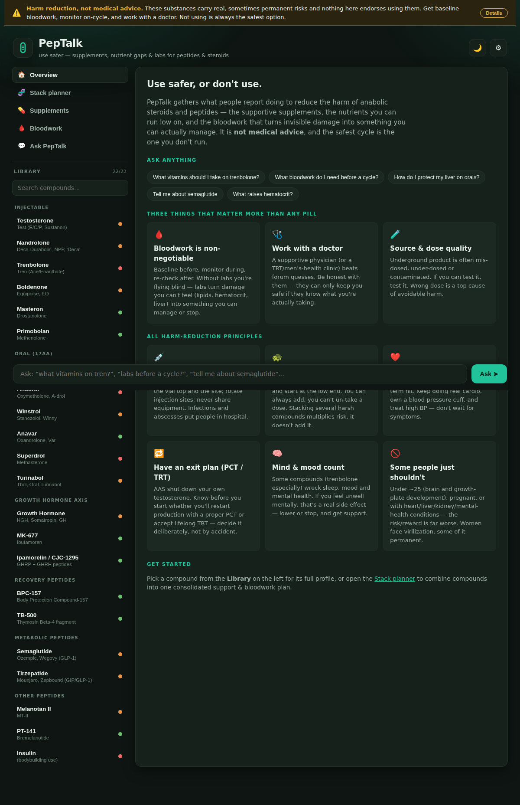
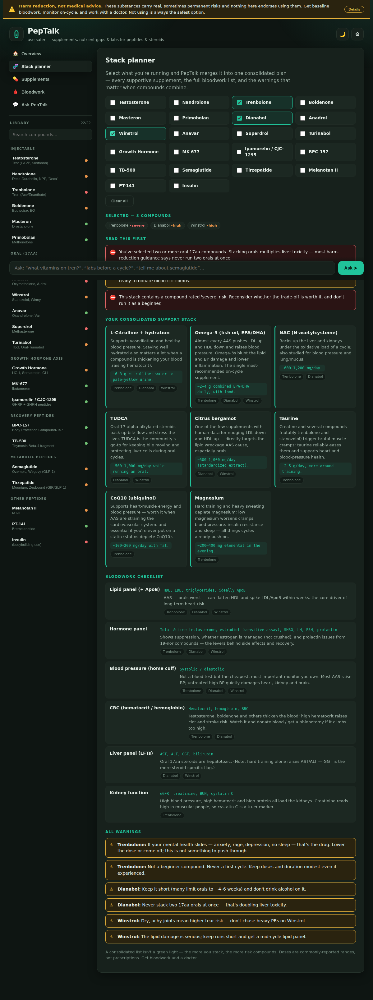

# PepTalk — use safer, or don't use 💊

A calm, non-judgmental **harm-reduction reference** for people using — or
considering — anabolic-androgenic steroids (AAS) and performance/therapeutic
peptides. It answers one practical question: *what do you do to make this
safer?* — the supportive **supplements**, the **nutrients you run low on**
because of a compound, and the **bloodwork** that turns invisible damage into
something you can actually manage.



> ## ⚠️ Not medical advice
> PepTalk is **educational harm-reduction information, not medical advice**, and
> nothing in it endorses using these substances. They carry real, sometimes
> permanent risks. Doses shown are *commonly-reported ranges from harm-reduction
> communities* so you can gauge whether you're wildly off — **not prescriptions.**
> Get baseline bloodwork, monitor on-cycle, and work with a licensed doctor.
> **The safest cycle is the one you don't run.**

## What it does

- 🚨 **Emergency warning signs** — 15 red-flag presentations sorted by what to do
  *right now*: call an ambulance (heart attack, stroke, pulmonary embolism, DVT,
  severe hypoglycemia, anaphylaxis), get seen today (liver injury, pancreatitis,
  abscess, hypertensive crisis, priapism, mental-health crisis), or stop and see
  a doctor. Reachable in one click from any screen, and the Ask box routes
  red-flag symptoms straight here instead of answering the literal question.
- 💉 **Injection safety** — sterile technique, one-needle-one-use, sites and
  volumes (ventrogluteal, vastus lateralis, delt, dorsogluteal, SubQ), rotation,
  sharps disposal, peptide reconstitution, and what a site infection looks like.
- 🔁 **Coming off & PCT** — what suppression actually is, why the crash is the
  highest-risk window for mental health, how a recovery is structured, fertility,
  and why "blast and cruise" is a decision rather than a default.
- ♀ **Women & virilization** — which effects are **permanent** (voice, clitoral
  enlargement, hirsutism, scalp hair) versus reversible, why the first sign means
  stop that day, and why counterfeits are themselves a virilization risk.
- 📚 **Compound library** — 22 common compounds grouped by class (injectable &
  oral steroids; growth-hormone, recovery, metabolic/GLP-1 and other peptides),
  each with a severity rating shown as a **label, never color alone**.
- 💊 **"What to take"** — for every compound: the supportive supplements and the
  nutrients you can run low on, each with *why*, a typical range, and the catch.
- 🩸 **Bloodwork to monitor** — the specific panels that matter for each compound
  (lipids/ApoB, CBC/hematocrit, liver, kidney, hormones, glucose, and more), plus
  a **printable request sheet** you can hand to a doctor or lab — it narrows to
  just the panels your selected stack needs.
- 🧬 **Stack planner** — tick everything you're running and PepTalk merges it into
  **one consolidated plan**: a de-duplicated support stack (tagged with which
  compound each item is for), the full bloodwork checklist, every warning, and
  **combined-risk flags** (e.g. *"two oral 17aa compounds — doubling liver
  toxicity"*).
- 💬 **Ask PepTalk** — a local Q&A brain answers questions offline
  (*"what vitamins on tren?"*, *"labs before a cycle?"*, *"how do I protect my
  liver?"*, *"tell me about semaglutide"*). Add an API key for open-ended Claude
  answers that stay in the harm-reduction framing.
- 🌗 **Light & dark themes**, keyboard-friendly, fully responsive.



## The harm-reduction stance

The tool is built on a few non-negotiables, surfaced everywhere:

1. **Bloodwork is non-negotiable** — baseline, on-cycle, and after.
2. **Work with a doctor** — be honest with them.
3. **Source & dose quality** — mis-dosing and contamination are top causes of harm.
4. **Injection hygiene**, **start low / one variable**, **cardio & blood pressure**,
   **have an exit plan (PCT/TRT)**, **mind & mood count**, and **some people just
   shouldn't** (under ~25, pregnant, or with heart/liver/kidney/mental-health
   conditions; women face virilization).

It never encourages or glamorizes use, and never shames — it meets someone where
they are and tries to reduce harm.

## Run it

Self-contained static site — no build step, no dependencies, no external
requests (system fonts, inline SVG):

```bash
# from this folder — pick whichever you have
python3 -m http.server 8000     # then open http://localhost:8000
npx serve .                      # or any static file server
```

Or just open `index.html` directly — everything works from `file://`.

## Optional: connect Claude

Open **Settings** (gear icon), paste an Anthropic API key, Save. Free-form
questions the local brain can't answer confidently route to Claude with
PepTalk's harm-reduction persona and the reference injected as context, so it
stays grounded and in-character. The key lives only in your browser's
`localStorage` and is sent directly to Anthropic from your machine; don't ship a
page with a baked-in key to other users. Without a key, everything above works
fully offline.

## Files

| File | Purpose |
|------|---------|
| `index.html` | App shell — disclaimer bar, sidebar/library, content area, composer, settings |
| `styles.css` | Clinical, calm design; dark + light themes; accessible severity labels |
| `data.js` | The knowledge base — compounds, supportive supplements, lab panels, principles |
| `brain.js` | Compound resolver, topic answers, consolidated stack planner, optional Claude |
| `app.js` | View router, rendering, stack builder, chat, theme & settings |

---

Built as part of this repo's family of self-contained static apps. Educational
harm reduction only — please, get bloodwork and see a doctor.
